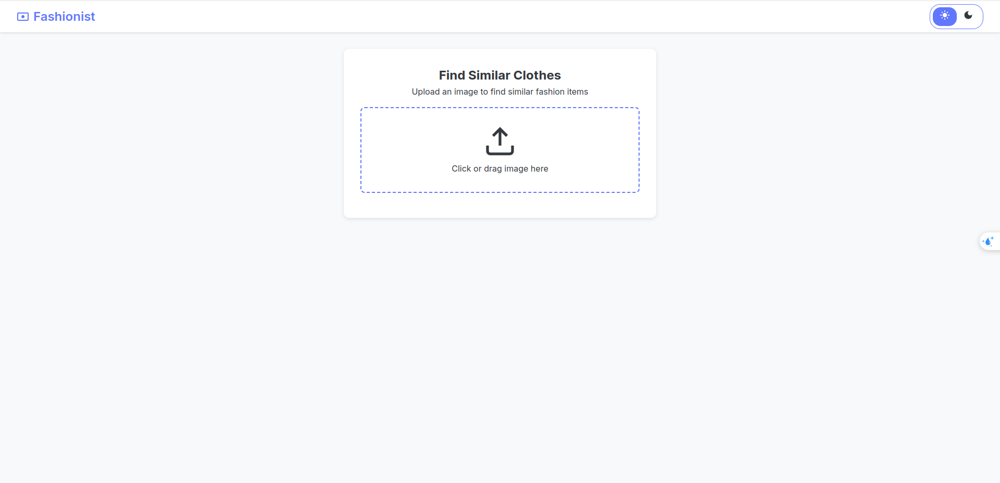
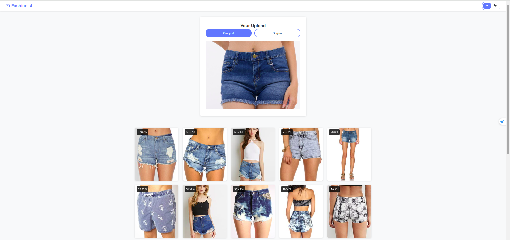

# Clothes_Search_Engine

## 1. Project Overview
The Clothes Search Engine project is a web application designed to help people can find similar clothes to the input clothes.

## 2. Project Components
### 2.1. DeepFashion Dataset
- Link dataset: https://mmlab.ie.cuhk.edu.hk/projects/DeepFashion.html.

### 2.2. Detection Model
- Use a clothes detection model from existing project on GitHub. 
    - Link: https://github.com/TanThinNguyen/fashion-visual-search.

### 2.3. Project pipeline
- Using **Detection Model** to get the clothes in the image then crop the clothe has highest detection score.
- Using **ResNet50** neurol network to extract features from the image and save to a **.npy** file.
- Using **FAISS(Facebook AI Similarity Search)** to save all **.npy** file to search.
- Buiding User Interface.

## 3. Getting started
### 3.1. Requirements
Main libraries:
- **Python version:** 3.8.18.
- **Tensorflow Object Detection API:** Install it in notebook.ipynb.
- **Numpy version:** 1.24.4.
- **Flask:** 3.0.3.
- **faiss-gpu version:** 1.7.2.
- **faiss-cpu version:** 1.8.0.
- **Tensorflow Version:** 2.13.1.
- **Pillow Version:** 10.4.0.

### 3.2. Getting Dataset
- Access to the Google Drive link of the DeepFashion Dataset then open the folder **"Category and Attribute Prediction Benchmark"**. After that, download file **img.zip**, extract and save it into folder **static** in the project folder.

### 3.3. Running The Project
1. Readding **notebook.ipynb** to get the **detection model** and **faiss_index** (download and save it into the project folder).
2. Run the web app:
```
python main.py 
```
## 4. Preview
- Front page: $\newline$


- Result page: $\newline$

